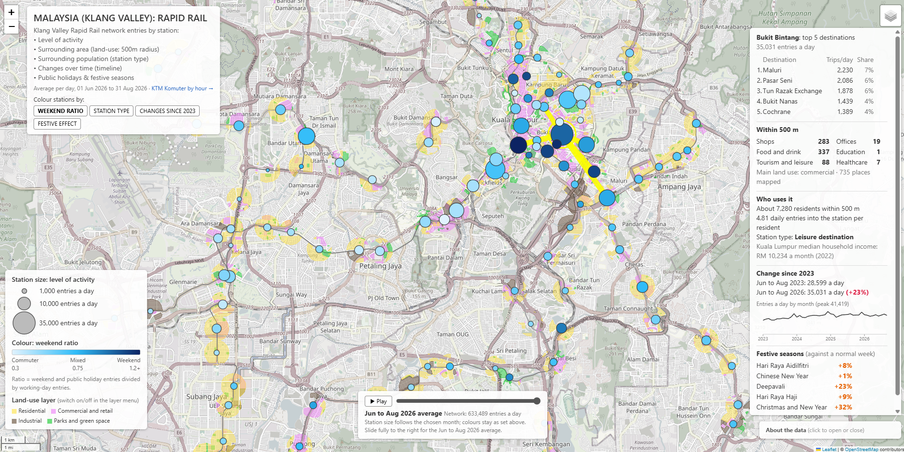
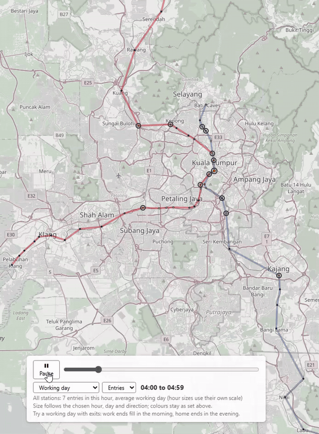
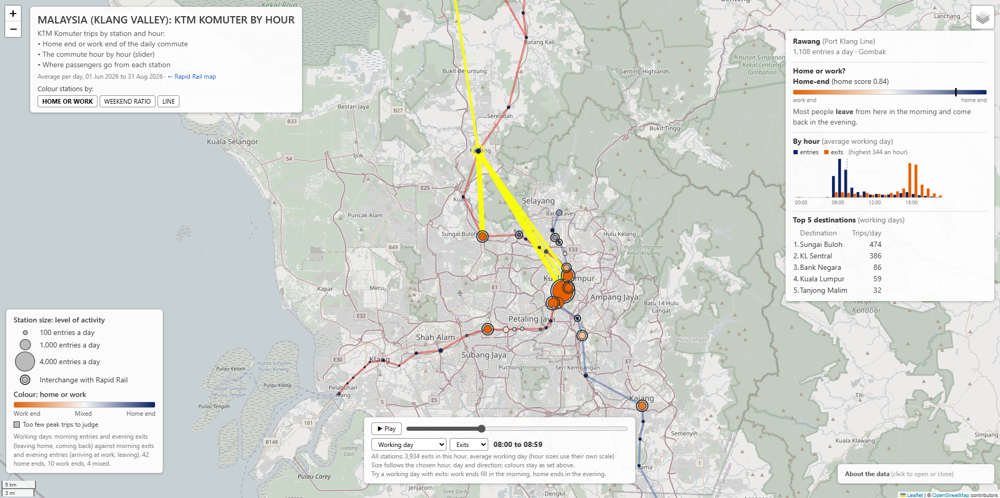

# Malaysia Klang Valley Rail Activity Map

An interactive web map of how people use the Rapid Rail network (LRT, MRT and Monorail) and KTM Komuter across the Klang Valley, Malaysia, built entirely from open government data.

**Live map (Rapid Rail):** https://likrentai.github.io/klmobility/  
**KTM Komuter by hour:** https://likrentai.github.io/klmobility/komuter.html  
**Case study:** https://likrentai.github.io/klmobility/case-study.html ([PDF version](docs/case-study.pdf))

*The Rapid Rail map, with Bukit Bintang selected: lines to its top 5 destinations, and a panel with its surroundings, residents, change since 2023 and festive effects. Click the image to open the live map.*

Each station is drawn by its **level of activity** (average passenger entries per day) and coloured by its **weekend ratio**: pale stations are busy on working days and quiet at weekends, which marks weekday commuting at either the home end or the work end of the journey; dark blue stations stay as busy or get busier at weekends, typical of shopping and leisure areas. Clicking a station draws lines to its top 5 destinations and lists what lies within 500 m of it (shops, food and drink, offices, education, healthcare, tourism and leisure, and the main land use) and who uses it (residents within 500 m, entries per resident, station type and district household income). A switch recolours the stations by **station type**, by **change since 2023**, or by **festive effect** (how much quieter or busier each station is during Hari Raya, Chinese New Year and four other festivals), and optional layers show land use around every station and median household income by district. A **time slider** resizes every station to its average entries in any month from January 2023 to September 2026, and the station panel includes a small chart of that station's monthly entries.

A second page shows **KTM Komuter by hour** (Version 6). Because Komuter data is hourly, it can show what the daily Rapid Rail data cannot: which stations are the **home end** and which the **work end** of the daily commute. An hourly slider replays an average day, and each station's panel has a 24-hour chart of entries and exits.

*An average working day on KTM Komuter, 05:00 to 23:00, sized by entries per hour: the navy home ends fill in the morning as people set off, and the orange work ends in the evening as they head home.*

## What the map shows

- **New places reshape travel.** Tun Razak Exchange (TRX) station tripled its daily entries (+204%, from about 5,100 to 15,600) after The Exchange TRX mall opened in November 2023, the largest gain on the network. Meanwhile the biggest hubs, KL Sentral, KLCC and Masjid Jamek, barely grew.
- **Festivals empty the offices first.** In the Hari Raya week the network is about a fifth quieter, but work-end stations lose 37% against 14% at leisure destinations. Bandar Tasik Selatan, next to the TBS bus terminal, gets *busier* as people travel home.
- **Hourly data separates home from work.** On KTM Komuter, 42 of the 58 stations analysed are home ends of the daily commute. Rawang's most common destination is not KL Sentral but Sungai Buloh, where passengers change to the MRT.
- **A rail upgrade is reshaping commuting.** Komuter trips fell 38% between 2024 and 2026, most sharply on the sections affected by the KVDT2 double-track works, while peak-hour commuting held up best.

*The sections below give the details and methods for each version.*

## Station activity (Version 1)

| Finding | Station | Figure |
|---|---|---|
| Most active station | Bukit Bintang | about 35,000 entries a day |
| Next most active | KL Sentral, KLCC | about 26,400 and 21,700 entries a day |
| Most commuter-like | Kerinchi (Bangsar South) | weekend ratio 0.27 |
| Other commuter hubs | Semantan, Raja Chulan | weekend ratios 0.32 and 0.34 |
| Most weekend-heavy | Pasar Seni (Petaling Street) | weekend ratio 1.27 |
| Other weekend draws | Imbi, Hang Tuah (Bukit Bintang area) | weekend ratios above 1.1 |

Travel is widely spread: on average, a station's top 5 destinations carry only about 43% of its trips.

## What surrounds each station (Version 2)

Places and land use within 500 m (about a 6 to 7 minute walk) of each station were counted from OpenStreetMap. The places with the most around them are the historic and shopping core of Kuala Lumpur:

| Station | Shops | Food and drink | Tourism and leisure | All places within 500 m |
|---|---|---|---|---|
| Chow Kit | 458 | 148 | 54 | 740 |
| Bukit Bintang | 283 | 337 | 88 | 735 |
| Masjid Jamek | 364 | 167 | 57 | 639 |
| Imbi | 237 | 263 | 83 | 609 |
| Pasar Seni | 254 | 195 | 51 | 538 |

### Does the surrounding area explain the weekend ratio?

The hypothesis was that weekday-heavy stations would sit among offices and weekend-heavy stations among shops and leisure. Two experiments tested it, using rank correlations between each measure and the weekend ratio. The answer is: **only moderately**.

| Finding | Evidence |
|---|---|
| Gaps in OpenStreetMap weaken every link | Among the 44 stations whose 500 m circle is at least 60% mapped, the correlations roughly double |
| Retail and commercial activity lean towards weekends | Well-mapped stations: shops 0.30, commercial land 0.23, food and drink 0.21; green space -0.22 |
| Office space leans towards weekdays, but too little is mapped to confirm it | Office buildings only: -0.14; just 171 office buildings are mapped, and only 7% of buildings have their number of storeys recorded |
| Malaysian shophouses distort building-based measures | Counting `commercial` buildings as workplaces flipped the result to +0.26, because shophouses and malls carry that tag (5,821 of them against 171 offices) |
| Home-end and work-end stations cannot be told apart | Both ends of a commute are busy on weekdays, and residential buildings show no link (0.08). Hourly ridership would be needed, and it is not published for Rapid Rail (it is for KTM Komuter: see Version 6) |

The weekend ratio is therefore best read as **when** a station is used, with its surroundings as supporting context rather than proof.

## Who uses each station (Version 3)

Residents within 500 m of each station were estimated from a gridded population map (Kontur, 400 m hexagons). Comparing them with ridership gives **entries per resident**: a low value means a station mainly serves the people living around it; a high value means most users come from elsewhere, to work, shop or visit. Combined with the weekend ratio, this sorts every station into one of four types:

| | Weekday-heavy (weekend ratio below 0.61) | Weekend-leaning (0.61 or above) |
|---|---|---|
| **Serves its residents** (below 0.47 entries per resident) | **Home-end commuter** (38 stations), e.g. Kinrara, Kelana Jaya, Sri Petaling, Puchong Prima | **Local neighbourhood** (38), e.g. Ampang, Cempaka, Pandan Jaya, Kampung Baru |
| **Draws visitors** (0.47 or above) | **Work-end commuter** (39), e.g. Kerinchi, Raja Chulan, Ampang Park, Abdullah Hukum | **Leisure destination** (39), e.g. Bukit Bintang, KL Sentral, KLCC, Pasar Seni |

The dividing values are the network medians, so each side holds about half the stations.

**This separates the two ends of commuting, which Version 2 could not.** Kerinchi (Bangsar South) and Raja Chulan (Golden Triangle) come out as work-end stations, while Sri Petaling comes out as home-end, even though all three are weekday-heavy. The busiest places are clear destinations: Bukit Bintang has about 35,000 entries a day from roughly 7,300 residents (4.8 entries per resident), and KLCC and Pasar Seni about 3.6 each.

| Check | Result |
|---|---|
| Robustness to the radius | Doubling the radius to 1,000 m changed the type of only 1 of 154 stations; every reference station kept its type |
| Residents vs ridership | Weak link (rank correlation +0.14): the number of people within walking distance only loosely predicts how many use a station |
| Known misfits | Residential stations with park-and-ride or feeder buses (e.g. Putra Heights, Setiawangsa) appear as work-end stations, because their users live beyond walking distance; widening the radius to 1 km did not change them |

Median monthly household income by district (DOSM) ranges from RM 8,837 in Klang to RM 11,404 in Ulu Langat (2024); Kuala Lumpur is RM 10,234 and Putrajaya RM 10,056 (2022, the latest year DOSM publishes for the federal territories). It is shown as broad context only, since Kuala Lumpur is a single district.

## How use has changed since 2023 (Version 4)

Average daily entries were calculated for every station and every calendar month from January 2023 to September 2026. To compare like with like, each station's June to August 2026 average is set against its June to August 2023 average, so school holidays and festive seasons fall in the same place in both years.

**The network grew by about a third.** Across the 135 stations that can be compared, entries rose from about 459,000 to 604,000 a day (+31.5%); the typical station grew by 29%, and only 2 stations fell. The network was at its lowest in April 2023 (about 398,000 a day, the Hari Raya month) and at its highest in August 2026 (about 638,000). Growth is slowing:

| June to August | Network entries a day | Change on the year before |
|---|---|---|
| 2023 | 459,000 | |
| 2024 | 548,000 | +19% |
| 2025 | 600,000 | +10% |
| 2026 | 614,000 | +2% (including the new Shah Alam Line from August) |

**The fastest growth came from new development and newer stations:**

| Station | June to August 2023 | June to August 2026 | Change | Likely reason |
|---|---|---|---|---|
| Tun Razak Exchange | 5,116 | 15,566 | +204% | [The Exchange TRX](https://en.wikipedia.org/wiki/The_Exchange_TRX) mall opened in November 2023; the largest gain of any station (+10,450 a day) |
| Pusat Bandar Damansara | 1,456 | 4,994 | +243% | [Pavilion Damansara Heights](https://en.wikipedia.org/wiki/Pavilion_Damansara_Heights) opened in stages from 2023 |
| Kwasa Damansara | 578 | 1,760 | +204% | Growing new township, and the interchange between the Kajang and Putrajaya Lines |
| CGC Glenmarie | 3,341 | 8,111 | +143% | Glenmarie business area; possibly also passengers transferring to the new Shah Alam Line in August 2026 |
| Putra Permai, Kuchai, Conlay | under 1,200 | 1,000 to 2,900 | +148% to +190% | Newer or suburban stations building up their ridership |

**The biggest hubs barely grew.** Masjid Jamek (+0.7%), KL Sentral (+3.4%) and KLCC (+6.3%) stayed almost level, while Damai (-7.8%) and Chow Kit (-2.0%) fell slightly. The extra trips went elsewhere, and not only to the suburbs: Bukit Bintang (+22.5%, about 6,400 more entries a day), Maluri and Ampang Park (about 5,000 more each) gained the most after Tun Razak Exchange. Growth was broad rather than concentrated: the median station grew by 35% in Kuala Lumpur and by 27% in Petaling.

| Check | Result |
|---|---|
| Stations too new to compare | The 19 Shah Alam Line (LRT3) stations opened in 2026 and are coloured separately on the map. Bandar Utama is compared on its Kajang Line platform only (+68.6%), so its new LRT3 platform does not count as growth |
| Putrajaya Line phase 2 | Opened on 16 March 2023; its stations are compared from June to August 2023, their first full summer, so part of their growth is early ramp-up |
| Small starting numbers | Large percentages at quiet stations (e.g. Sultan Ismail, +229% from about 530 a day) mean little in absolute terms; the map shows size and change together for this reason |

## Public holidays and festive seasons (Version 5)

For each festival, every station's entries are compared with its **usual entries on the same day of the week** in the four weeks before and after, pooled over 2023 to 2026. The festive weeks are measured as a whole: the Hari Raya Aidilfitri and Chinese New Year weeks run from the day before to six days after, and Christmas and New Year from 24 December to 1 January.

| Festival | Network, against a normal week | Years measured |
|---|---|---|
| Hari Raya Aidilfitri week | -21% (every year between -19% and -23%) | 2023 to 2026 |
| Chinese New Year week | -20% | 2023 to 2026 |
| Deepavali (three days) | -10% | 2023 to 2025 |
| Christmas and New Year | -7% | 2023 to 2025 |
| Hari Raya Haji (the day) | -31% | 2023 to 2026 |
| National Day, 31 August | -8% (a loss on weekdays, a gain at weekends) | 2023 to 2026 |

**Station types react as expected.** Offices close, so work-end stations empty the most, while leisure destinations hold up best:

| Station type | Hari Raya week | Chinese New Year week | Christmas and New Year |
|---|---|---|---|
| Work-end commuter | -37% | -33% | -21% |
| Home-end commuter | -29% | -32% | -21% |
| Local neighbourhood | -21% | -21% | -10% |
| Leisure destination | -14% | -12% | -3% |

**Holidays largely behave like weekends.** The festive effect closely follows the weekend ratio (rank correlations of 0.68 to 0.88), so the more telling stations are those that depart from it:

| Station | What happens | Likely reason |
|---|---|---|
| Bandar Tasik Selatan | Busier than a normal week at Hari Raya (+6%) and Chinese New Year (+17%) | Serves the TBS long-distance bus terminal, used by people travelling home for the festival (balik kampung) |
| Pasar Seni, Imbi, Chow Kit | 14% to 35% busier during both festive weeks | Shopping and gathering places that stay open |
| Bukit Bintang, Pasar Seni | +32% and +24% over Christmas and New Year | Shopping and New Year crowds |
| Putrajaya Sentral | 4 to 6 times its usual entries on National Day, every year (about +309%) | The National Day parade at Dataran Putrajaya ([2025](https://thesmartlocal.my/merdeka-day-2025-parade/), [2026](https://www.nst.com.my/news/nation/2026/08/1521767/dataran-putrajaya-set-dazzle-national-day-parade-air-show)) |
| Bukit Jalil, PWTC | Quieter than their weekend ratio suggests during festive weeks | Their weekend crowds come from stadium and exhibition events, which pause at festivals |
| Merdeka, Kerinchi | Among the quietest (about -45% to -56% at Hari Raya) | Office districts |

Single-day holidays vary with the day they fall on: one on a working day loses its commuters, while one at a weekend is compared with normal weekends and changes little (Hari Raya Haji 2025, a Saturday, was only -7%). The festive weeks are the most reliable results. All other public holidays were also measured as one group, but they are not shown on the map because they mostly repeat the weekend ratio (rank correlation 0.88).

## KTM Komuter by hour (Version 6)

KTM Komuter publishes its trips by origin, destination **and hour**, which Rapid Rail does not. This page uses June to August 2026 (the same period as the Rapid Rail map), with every trip that has at least one end in the Klang Valley, including long commutes from Seremban and Tanjong Malim.

**The commute in hours.** On working days, 42% of entries fall in the morning peak (06:00 to 09:59) and 32% in the evening peak (16:00 to 19:59); the busiest hour is 08:00, with 16% of the day's entries. Weekends have no sharp peak (busiest hour 11:00, 10%).

**Home end or work end.** On working days, people leave home in the morning and come back in the evening, while a workplace sees the opposite. Each station gets a **home score**: morning entries plus evening exits, divided by all four peak counts. A score near 1 is a home end, near 0 a work end. A simpler measure using entries only (the morning share) agrees almost perfectly (rank correlation 0.99).

| Type | Stations | Examples (home score) |
|---|---|---|
| Work end (0.4 or below) | 10 | Abdullah Hukum (0.04), Mid Valley (0.06), Bank Negara (0.09), KL Sentral (0.12), Subang Jaya (0.13), Sungai Buloh (0.17), Kajang (0.25) |
| Mixed | 4 | Sentul, Setia Jaya, Seri Setia, Kampung Dato Harun |
| Home end (0.6 or above) | 42 | Rawang (0.84), Klang (0.86), Shah Alam (0.87), Bangi (0.96), Seremban (0.97), Nilai and Senawang (0.98) |

**Komuter is mostly a home-end network**: suburbs and the outer belt feed a short list of destinations in and around central Kuala Lumpur.

**Transfers look like work ends.** Rawang's most common destination is not KL Sentral but **Sungai Buloh** (474 trips a working day against 386), where passengers can change to the MRT Kajang Line. Seremban's second destination is Kajang (116), another MRT interchange. Stations such as Sungai Buloh, Kajang, Subang Jaya and Bandar Tasek Selatan are therefore transfer points as much as workplaces: a passenger changing trains leaves Komuter there in the morning, just like someone arriving at work.

*Exits at 08:00 on a working day, with Rawang selected: its thickest line runs to Sungai Buloh (an MRT interchange), and its hourly chart shows entries in the morning and exits in the evening, the mark of a home end.*

**Checked against the Rapid Rail station types.** At the 13 stations within 450 m of a Rapid Rail station, 12 agree with the Version 3 station types in the broad sense (home end with home-end or local; work end with work-end or leisure), and 6 agree strictly. Most of the gap is Rapid Rail "leisure destinations" (KL Sentral, Pasar Seni, PWTC, Bandar Tasik Selatan) that are Komuter work ends, which fits the transfer explanation. The one real disagreement is Salak Selatan (a Komuter home end, a Rapid Rail work end).

**Ridership is falling, most likely because of track works.** Komuter trips fell by 38% between June to August 2024 and 2026, but not evenly:

| Group | Change, June to August 2024 to 2026 |
|---|---|
| Weekday peak hours | -29% |
| Weekday off-peak hours | -45% |
| Weekends | -53% |
| From the Seremban Line | -51% |
| From the Port Klang Line | -34% |

The largest falls are on the Port Klang Line south of KL Sentral (Klang -70%, Subang Jaya -69%) and on the Seremban Line (Bandar Tasek Selatan -74%, Seremban -70%), while the northern Port Klang Line grew (Rawang +23%, Tanjong Malim +39%). This is consistent with the [KVDT2 double-track upgrading works](https://paultan.org/2024/04/18/kvdt2-project-starts-in-port-klang-two-ktm-komuter-lines-affected-new-schedule-effective-apr-20-released/), which have changed Komuter timetables since April 2024; in 2026 the Port Klang to KL Sentral line closes daily from 11:00 to 15:00, with works expected to continue until 2029 ([Free Malaysia Today](https://www.freemalaysiatoday.com/category/nation/2025/12/14/new-ktm-komuter-timetable-for-klang-valley-from-jan-1)). Fewer trains and midday closures hit off-peak and weekend riders hardest, while commuters keep travelling at the peaks. The peak-hour results above are therefore the most reliable part of this page.

## How it was built

| Step | Notebook | What it does |
|---|---|---|
| 1 | `01datapreparation.ipynb` | Downloads ridership and station data, cleans and joins them, and saves small ready-to-map files in `data/processed` |
| 2 | `03context1.ipynb` | Counts places and measures land use within 500 m of each station from OpenStreetMap |
| 3 | `03context2.ipynb` | Experiments: well-mapped stations only, and building floor area as a measure of workplaces and homes |
| 4 | `04population1.ipynb` | Estimates residents within 500 m of each station, computes entries per resident, assigns station types, and adds district household income |
| 5 | `05timeline1.ipynb` | Downloads the yearly ridership files from 2023, computes average daily entries by station and month, and compares June to August 2023 with June to August 2026 |
| 6 | `06holidays1.ipynb` | Measures each station's entries during public holidays and festive seasons against a normal week at the same station |
| 7 | `02buildmap.ipynb` | Reads the prepared files and draws the interactive map, saved as `docs/index.html` |
| 8 | `07komuter1.ipynb` | Loads the hourly KTM Komuter trips, removes pseudo-stations, keeps trips with at least one Klang Valley end, and examines the falling trend |
| 9 | `07komuter2.ipynb` | Locates every Komuter station from the KTMB GTFS feed (two from OpenStreetMap), checks them against the district boundaries, and finds the interchanges with Rapid Rail |
| 10 | `07komuter3.ipynb` | Computes hourly profiles, the home score and station types, the interchange comparison and top destinations |
| 11 | `02buildkomuter.ipynb` | Draws the Komuter page, saved as `docs/komuter.html` |

Main methods:

- **Separating totals from flows.** The source file mixes daily station totals with station-to-station trips; mixing them doubles every count, so they are split before any analysis.
- **Station matching.** Ridership station codes (e.g. `KG18: Bukit Bintang`) are matched to GTFS coordinates by cleaned name and line code, handling interchanges, sponsor names (e.g. KL Sentral - REDONE) and differently padded codes. All 154 places are matched.
- **New stations averaged over their days in service.** A station that opened during the period is averaged only over the days it has data, not counted as zero before it opened. The Shah Alam Line (LRT3) opened on 29 June 2026 with free rides until 31 July, so its 20 stations have taps only from 1 August; without this correction their activity would be understated about threefold. Each line code is averaged separately and summed per place, so Bandar Utama (Kajang Line and LRT3) counts both platforms correctly.
- **Fair comparisons over time.** Monthly figures are averages over the days each line code had data, so a station that opened mid-month is not understated, and a month with fewer than 7 days of data is left out. The change since 2023 compares the same three months in both years, and only line codes with at least 30 days of data in both.
- **Holiday effects against a same-weekday baseline.** A holiday on a Monday is compared with normal Mondays at the same station (the median over four weeks before and four weeks after the window, leaving out other holidays and the day after a holiday). Kuala Lumpur, Putrajaya and Selangor holiday calendars are applied by each station's state.
- **Working days vs weekends.** Public holidays in Kuala Lumpur are grouped with weekends, because travel on those days behaves like a weekend. The period has 61 working days and 31 weekend and holiday days.
- **Spatial joins.** Each station is tagged with its district and parliamentary constituency using DOSM boundary files.
- **Areal interpolation.** Where a population hexagon is only partly inside a station's circle, it contributes the same share of its population as the share of its area inside.
- **Home score (Komuter).** On working days, morning entries plus evening exits (leaving home, coming back) are compared with morning exits plus evening entries (arriving at work, leaving). Stations with fewer than 50 peak trips a day are not typed.
- **Komuter station positions.** 64 stations come from the KTMB GTFS feed; Seri Setia (whose GTFS position duplicates Setia Jaya) and Segambut Utara (opened in March 2026, not yet in GTFS) come from OpenStreetMap. The track is drawn station to station in timetable order.
- **Walking-distance circles.** 500 m circles are drawn in a metre-based map projection (UTM zone 47N), and OpenStreetMap features are counted by their centre point, so a mall counts once.

**Tools:** Python, pandas, GeoPandas, OSMnx, Folium (Leaflet), holidays, Jupyter.

## Data sources

| Data | Source | Licence |
|---|---|---|
| Daily origin-destination ridership, Rapid Rail (Klang Valley), 2023 to 2026 | [data.gov.my](https://data.gov.my/data-catalogue/ridership_od_rapidrail_daily) (Prasarana) | CC BY 4.0 |
| Station locations (GTFS static feed) | [data.gov.my Open API](https://developer.data.gov.my/realtime-api/gtfs-static) (Prasarana) | CC BY 4.0 |
| Hourly origin-destination ridership, KTM Komuter, 2023 to 2026 | [data.gov.my](https://data.gov.my/data-catalogue/ridership_od_komuter) (KTMB) | CC BY 4.0 |
| Komuter station locations and timetable (GTFS static feed) | [data.gov.my Open API](https://developer.data.gov.my/realtime-api/gtfs-static) (KTMB) | CC BY 4.0 |
| District and constituency boundaries | [Department of Statistics Malaysia (DOSM)](https://github.com/dosm-malaysia/data-open) | Open data |
| Places, land use and buildings around stations | [OpenStreetMap](https://www.openstreetmap.org/copyright) contributors, via OSMnx | ODbL |
| Population, 400 m hexagons (1 November 2023) | [Kontur Population: Malaysia](https://data.humdata.org/dataset/kontur-population-malaysia) via HDX | CC BY 4.0 |
| Household income by district | [DOSM Household Income and Expenditure Survey](https://open.dosm.gov.my/data-catalogue/hh_income_district) | Open data |
| Base map | [OpenStreetMap](https://www.openstreetmap.org/copyright) contributors | ODbL |

## Limitations

- **Putrajaya Line exits are missing in the source data.** The 32 stations from Damansara Damai (PYL05) to Putrajaya Sentral (PYL41) record entries, but no trip is ever recorded as ending there. Network totals still balance, so those exits are credited to other stations and cannot be recovered. For this reason the map measures activity by entries only, and no destination line ends at those stations.
- **Daily data only for Rapid Rail.** Morning and evening peaks cannot be separated there; the working-day and weekend comparison stands in for that. KTM Komuter data is hourly (Version 6).
- **Stations, not journeys.** Tap-in and tap-out data shows which stations people used, not where their journeys actually began or ended.
- **Two networks, two pages.** Rapid Rail and KTM Komuter are shown on separate pages, since their volumes differ about eightfold and their data differ (daily against hourly). The airport rail link is not included.
- **Komuter trips have one hour each**, most likely when the trip started, so exits are shown in the hour the passenger boarded. The dataset itself notes that counts may not exactly match passengers, especially on short routes.
- **Komuter work ends include transfer points.** Passengers changing to the LRT or MRT leave Komuter in the morning, like people arriving at work.
- **Komuter track works.** The KVDT2 upgrading has cut services since 2024; midday hours on the Port Klang Line in 2026 reflect the 11:00 to 15:00 closures as well as demand. The Komuter track is drawn as straight lines between stations, not the real alignment.
- **The weekend ratio is a clue, not proof** of land use. Weekday-heavy stations include both residential (home end) and office (work end) stations, and a station can be quiet at weekends for other reasons, such as a nearby university.
- **New Shah Alam Line (LRT3) stations have a short record.** Their figures cover August 2026 only, their first month of paid service, when curiosity trips may still lift weekend use. The map marks them as new.
- **Change over time compares two summers.** June to August 2023 and 2026 are like-for-like, but one period cannot show every shift; the monthly chart for each station shows the full pattern. The last month shown may be incomplete.
- **Festive effects depend on the calendar.** Only three or four of each festival are available, and single-day holidays depend on the day of the week they fall on. School holidays are not included, because they are not in the holiday calendar used; they can be added by hand in notebook 6. The new Shah Alam Line stations have no festive data yet.
- **Station types assume people walk to the station.** Stations with park-and-ride car parks or feeder buses draw users from further away and can be classed as destinations.
- **Population is a modelled estimate.** Kontur distributes census and satellite-derived population across hexagons; it is reliable at neighbourhood scale but not a count.
- **Income is coarse.** It is published by district only, and for Kuala Lumpur and Putrajaya the latest year is 2022.
- **OpenStreetMap is mapped by volunteers.** Counts of places show what has been mapped, not an official census; central Kuala Lumpur is well covered, some outer areas less so.

## Running it yourself

Requires Python 3.11 or later.

1. Install the libraries: `pip install pandas pyarrow geopandas osmnx folium requests holidays jupyter`
2. Run `01datapreparation.ipynb`. The first run downloads about 5 MB of ridership data and caches it in `data/raw`.
3. Run `03context1.ipynb`. The first run fetches OpenStreetMap data, which can take several minutes, and caches it.
4. Optionally run `03context2.ipynb` to repeat the experiments.
5. Run `04population1.ipynb`. The first run downloads the population (about 11 MB) and income data and caches them.
6. Run `05timeline1.ipynb`. The first run downloads the yearly ridership files from 2023 and caches them.
7. Run `06holidays1.ipynb`. It reuses the ridership files saved by notebook 5.
8. Run `02buildmap.ipynb`. All visual settings (marker shape, colours, sizes, text, land-use, station-type, income, change and festive colours, button labels and the time slider) are in its first code cell.
9. For the Komuter page, download the yearly files `komuter_2023.parquet` to `komuter_2026.parquet` from data.gov.my and the KTMB GTFS feed (saved as `gtfs_ktmb.zip`) into `data/raw` if the notebooks cannot download them, then run `07komuter1.ipynb`, `07komuter2.ipynb` (it fetches two station positions from OpenStreetMap once) and `07komuter3.ipynb`.
10. Run `02buildkomuter.ipynb`. Its first code cell holds all the page's visual settings.

To refresh with newer data, change the two dates at the top of notebook 1 and follow the steps in its final section, then rerun `05timeline1.ipynb` (it downloads the current year again), `06holidays1.ipynb` and `02buildmap.ipynb`.

## Author
Lik Ren Tai
